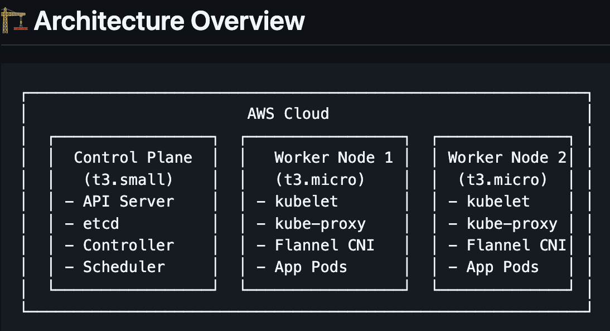
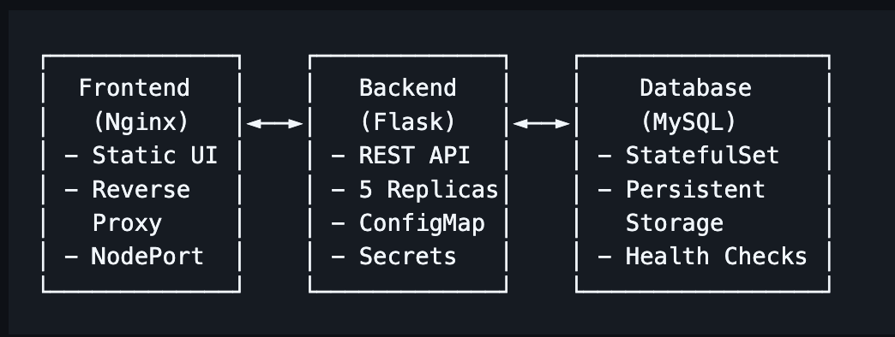
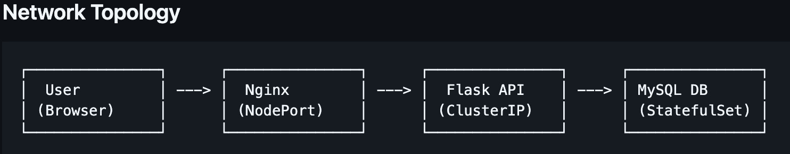

<<<<<<< HEAD
```markdown
=======

>>>>>>> b8fb812 (Added README file)
# Kubernetes Hands-On Learning Project 🚀

[](https://kubernetes.io/)
[](https://aws.amazon.com/)
[](https://ubuntu.com/)
[](LICENSE)
[](https://github.com/yourusername/kubernetes-hands-on-project/pulls)

> A comprehensive, production-ready Kubernetes learning project featuring a 3-tier web application deployed on a self-managed cluster built from scratch on AWS Ubuntu instances.

## 🎯 Project Overview

This repository documents my complete journey of building and managing a Kubernetes cluster from scratch using **kubeadm** on AWS EC2 Ubuntu instances, deploying a full-stack 3-tier application, and implementing DevOps best practices. The project serves as both a learning resource and a portfolio showcase demonstrating real-world Kubernetes skills.

### What Makes This Project Special

- **Built from Scratch**: No managed services - pure Kubernetes learning
- **Real Production Challenges**: Faced and solved actual deployment issues
- **Complete Documentation**: Every command, every troubleshooting step documented
- **3-Tier Architecture**: Database, API, and Frontend with proper service discovery
- **Production Ready**: Health checks, scaling, monitoring, and best practices

## 🏗️ Architecture Overview

<<<<<<< HEAD
### Infrastructure Architecture
```
┌─────────────────────────────────────────────────────────────┐
│                        AWS Cloud                            │
│  ┌─────────────────┐  ┌─────────────────┐  ┌──────────────┐ │
│  │  Control Plane  │  │   Worker Node 1 │  │ Worker Node 2│ │
│  │   (t3.small)    │  │   (t3.micro)    │  │  (t3.micro)  │ │
│  │                 │  │                 │  │              │ │
│  │ -  API Server    │  │ -  kubelet       │  │ -  kubelet    │ │
│  │ -  etcd          │  │ -  kube-proxy    │  │ -  kube-proxy │ │
│  │ -  Controller    │  │ -  Flannel CNI   │  │ -  Flannel CNI│ │
│  │ -  Scheduler     │  │ -  App Pods      │  │ -  App Pods   │ │
│  └─────────────────┘  └─────────────────┘  └──────────────┘ │
└─────────────────────────────────────────────────────────────┘
```

### Application Architecture
```
┌──────────────────────────────────────────────────────────────┐
│                     3-Tier Application                       │
│                                                              │
│  ┌─────────────┐    ┌─────────────┐    ┌─────────────────┐   │
│  │  Frontend   │    │   Backend   │    │    Database     │   │
│  │   (Nginx)   │◄──►│   (Flask)   │◄──►│    (MySQL)      │   │
│  │             │    │             │    │                 │   │
│  │ -  Static UI │    │ -  REST API  │    │ -  StatefulSet   │   │
│  │ -  Reverse   │    │ -  5 Replicas│    │ -  Persistent    │   │
│  │   Proxy     │    │ -  ConfigMap │    │   Storage       │   │
│  │ -  NodePort  │    │ -  Secrets   │    │ -  Health Checks │   │
│  └─────────────┘    └─────────────┘    └─────────────────┘   │
└──────────────────────────────────────────────────────────────┘
```

## 📁 Repository Structure

```
kubernetes-hands-on-project/
├── README.md                              # This comprehensive guide
├── LICENSE                                # MIT License
├── .gitignore                            # Git ignore patterns
│
├── 📁 docs/                              # Complete Documentation
│   ├── 01-prerequisites/
│   │   ├── README.md                     # Prerequisites overview
│   │   ├── aws-setup.md                  # AWS EC2 setup guide
│   │   └── ubuntu-preparation.md         # Ubuntu system preparation
│   │
│   ├── 02-cluster-setup/
│   │   ├── README.md                     # Cluster setup overview
│   │   ├── control-plane-setup.md        # Master node configuration
│   │   ├── worker-nodes-setup.md         # Worker nodes joining
│   │   ├── networking-setup.md           # Flannel CNI installation
│   │   ├── metrics-server.md             # Monitoring setup
│   │   └── troubleshooting.md            # Common setup issues
│   │
│   ├── 03-application-deployment/
│   │   ├── README.md                     # Application overview
│   │   ├── database-tier.md              # MySQL StatefulSet
│   │   ├── backend-tier.md               # Flask API deployment
│   │   ├── frontend-tier.md              # Nginx frontend
│   │   ├── service-discovery.md          # Inter-service communication
│   │   └── testing-validation.md         # Testing procedures
│   │
│   ├── 04-cluster-upgrade/
│   │   ├── README.md                     # Upgrade strategy
│   │   ├── upgrade-planning.md           # Pre-upgrade checklist
│   │   ├── upgrade-procedure.md          # Step-by-step upgrade
│   │   └── rollback-strategy.md          # Disaster recovery
│   │
│   └── 05-best-practices/
│       ├── security.md                   # Security hardening
│       ├── monitoring.md                 # Observability setup
│       ├── backup-recovery.md            # Data protection
│       └── production-readiness.md       # Production checklist
│
├── 📁 scripts/                           # Automation Scripts
│   ├── 00-prerequisites/
│   │   ├── aws-instance-setup.sh         # EC2 instance preparation
│   │   ├── ubuntu-system-prep.sh         # System updates & tools
│   │   └── validate-prerequisites.sh     # Pre-flight checks
│   │
│   ├── 01-cluster-setup/
│   │   ├── install-docker.sh             # Docker installation
│   │   ├── install-kubernetes.sh         # K8s components
│   │   ├── init-control-plane.sh         # Master node setup
│   │   ├── join-worker-nodes.sh          # Worker node joining
│   │   ├── setup-flannel-cni.sh          # Network plugin
│   │   ├── setup-metrics-server.sh       # Monitoring components
│   │   └── validate-cluster.sh           # Cluster health check
│   │
│   ├── 02-application-deploy/
│   │   ├── deploy-database.sh            # MySQL deployment
│   │   ├── deploy-backend.sh             # Flask API deployment
│   │   ├── deploy-frontend.sh            # Nginx deployment
│   │   ├── create-secrets-configs.sh     # ConfigMaps & Secrets
│   │   └── validate-application.sh       # End-to-end testing
│   │
│   └── 03-utilities/
│       ├── cluster-status.sh             # Health monitoring
│       ├── backup-cluster.sh             # Backup procedures
│       ├── cleanup-cluster.sh            # Resource cleanup
│       └── reset-cluster.sh              # Complete reset
│
├── 📁 k8s-manifests/                     # Kubernetes YAML Files
│   ├── 00-namespace/
│   │   └── application-namespace.yaml    # Application namespace
│   │
│   ├── 01-database/
│   │   ├── mysql-secret.yaml             # Database credentials
│   │   ├── mysql-configmap.yaml          # Database configuration
│   │   ├── mysql-pvc.yaml                # Persistent volume claim
│   │   ├── mysql-statefulset.yaml        # MySQL StatefulSet
│   │   └── mysql-service.yaml            # Database service
│   │
│   ├── 02-backend/
│   │   ├── flask-configmap.yaml          # Backend configuration
│   │   ├── flask-secret.yaml             # API secrets
│   │   ├── flask-deployment.yaml         # Flask deployment
│   │   └── flask-service.yaml            # Backend service
│   │
│   ├── 03-frontend/
│   │   ├── nginx-configmap.yaml          # Nginx configuration
│   │   ├── nginx-deployment.yaml         # Frontend deployment
│   │   └── nginx-service.yaml            # Frontend service (NodePort)
│   │
│   └── 04-monitoring/
│       ├── metrics-server.yaml           # Metrics server
│       └── resource-quota.yaml          # Resource limitations
│
├── 📁 application-code/                  # Application Source Code
│   ├── backend/
│   │   ├── app.py                        # Flask application
│   │   ├── requirements.txt              # Python dependencies
│   │   ├── config.py                     # Application config
│   │   ├── Dockerfile                    # Backend container
│   │   └── health.py                     # Health check endpoint
│   │
│   └── frontend/
│       ├── index.html                    # Main web page
│       ├── style.css                     # Styling
│       ├── script.js                     # Frontend logic
│       ├── nginx.conf                    # Nginx configuration
│       └── Dockerfile                    # Frontend container
│
├── 📁 infrastructure/                    # Infrastructure Configuration
│   ├── kubeadm-config.yaml              # Cluster initialization
│   ├── flannel-config.yaml              # CNI configuration
│   ├── storage-class.yaml               # Local storage class
│   └── network-policy.yaml              # Network security
│
└── 📁 troubleshooting/                   # Issue Resolution
    ├── common-issues.md                  # FAQ and solutions
    ├── cluster-debugging.md              # Cluster troubleshooting
    ├── application-debugging.md          # App troubleshooting
    └── performance-tuning.md             # Optimization guide
```

=======


### Infrastructure Architecture

```plaintext
┌─────────────────────────────────────────────────────────────┐
│                        AWS Cloud                           │
│  ┌─────────────────┐  ┌─────────────────┐  ┌──────────────┐│
│  │ Control Plane   │  │ Worker Node 1   │  │ Worker Node 2││
│  │  (t3.small)     │  │  (t3.micro)     │  │  (t3.micro)  ││
│  │ - API Server    │  │ - kubelet       │  │ - kubelet    ││
│  │ - etcd          │  │ - kube-proxy    │  │ - kube-proxy ││
│  │ - Controller    │  │ - Flannel CNI   │  │ - Flannel CNI││
│  │ - Scheduler     │  │ - App Pods      │  │ - App Pods   ││
│  └─────────────────┘  └─────────────────┘  └──────────────┘│
└─────────────────────────────────────────────────────────────┘
```

> **Tip:** For best clarity, view the PNG diagram below.



### Application Architecture

```plaintext
┌─────────────┐    ┌─────────────┐    ┌─────────────────┐
│  Frontend   │    │   Backend   │    │    Database     │
│   (Nginx)   │◄──►│   (Flask)   │◄──►│    (MySQL)      │
│ - Static UI │    │ - REST API  │    │ - StatefulSet   │
│ - Reverse   │    │ - 5 Replicas│    │ - Persistent    │
│   Proxy     │    │ - ConfigMap │    │   Storage       │
│ - NodePort  │    │ - Secrets   │    │ - Health Checks │
└─────────────┘    └─────────────┘    └─────────────────┘
```

> **Tip:** For best clarity, view the PNG diagram below.



### Network Topology

```plaintext
┌───────────────┐      ┌───────────────┐      ┌───────────────┐      ┌───────────────┐
│  User         │ ---> │  Nginx        │ ---> │  Flask API    │ ---> │ MySQL DB      │
│ (Browser)     │      │ (NodePort)    │      │ (ClusterIP)   │      │ (StatefulSet) │
└───────────────┘      └───────────────┘      └───────────────┘      └───────────────┘
```

> **Tip:** For best clarity, view the PNG diagram below.




## 📁 Repository Structure


```text
kubernetes-hands-on-project/
├── README.md
├── LICENSE
├── .gitignore
├── docs/
│   ├── 01-cluster-setup/
│   │   ├── README.md
│   │   ├── aws-infrastructure.md
│   │   ├── kubeadm-installation.md
│   │   ├── networking-setup.md
│   │   ├── metrics-server.md
│   │   └── troubleshooting.md
│   ├── 02-application-deployment/
│   │   ├── README.md
│   │   ├── database-tier.md
│   │   ├── backend-tier.md
│   │   ├── frontend-tier.md
│   │   ├── service-discovery.md
│   │   └── testing-validation.md
│   ├── 03-cluster-upgrade/
│   │   ├── README.md
│   │   ├── upgrade-planning.md
│   │   ├── upgrade-procedure.md
│   │   └── rollback-strategy.md
│   ├── architecture/
│   │   ├── cluster-architecture.md
│   │   ├── application-architecture.md
│   │   └── network-topology.md
│   ├── troubleshooting/
│   │   ├── common-issues.md
│   │   ├── cluster-issues.md
│   │   └── application-issues.md
│   └── best-practices/
│       ├── security.md
│       ├── monitoring.md
│       ├── backup-recovery.md
│       └── production-readiness.md
├── infrastructure/
│   ├── aws/
│   │   ├── ec2-setup.sh
│   │   ├── security-groups.yaml
│   │   └── user-data.sh
│   ├── kubeadm/
│   │   ├── kubeadm-config.yaml
│   │   ├── flannel-config.yaml
│   │   └── metrics-server-config.yaml
│   └── storage/
│       ├── local-storage-class.yaml
│       └── pv-examples.yaml
├── application/
│   ├── database/
│   │   ├── mysql-secret.yaml
│   │   ├── mysql-configmap.yaml
│   │   ├── mysql-statefulset.yaml
│   │   ├── mysql-service.yaml
│   │   └── mysql-pvc.yaml
│   ├── backend/
│   │   ├── flask-app/
│   │   │   ├── app.py
│   │   │   ├── requirements.txt
│   │   │   ├── Dockerfile
│   │   │   └── config.py
│   │   ├── flask-deployment.yaml
│   │   ├── flask-service.yaml
│   │   ├── flask-configmap.yaml
│   │   └── flask-secret.yaml
│   ├── frontend/
│   │   ├── nginx-app/
│   │   │   ├── index.html
│   │   │   ├── style.css
│   │   │   ├── script.js
│   │   │   ├── nginx.conf
│   │   │   └── Dockerfile
│   │   ├── nginx-deployment.yaml
│   │   ├── nginx-service.yaml
│   │   └── nginx-configmap.yaml
│   └── monitoring/
│       ├── monitoring-namespace.yaml
│       ├── resource-quota.yaml
│       └── network-policies.yaml
├── scripts/
│   ├── cluster-setup/
│   │   ├── 00-prerequisites.sh
│   │   ├── 01-install-docker.sh
│   │   ├── 02-install-kubernetes.sh
│   │   ├── 03-init-cluster.sh
│   │   ├── 04-setup-networking.sh
│   │   └── 05-setup-metrics.sh
│   ├── application-deploy/
│   │   ├── deploy-database.sh
│   │   ├── deploy-backend.sh
│   │   ├── deploy-frontend.sh
│   │   └── validate-deployment.sh
│   ├── monitoring/
│   │   ├── health-check.sh
│   │   ├── resource-monitor.sh
│   │   └── load-test.sh
│   └── utilities/
│       ├── backup-etcd.sh
│       ├── cleanup.sh
│       └── reset-cluster.sh
├── images/
│   ├── architecture/
│   │   ├── cluster-overview.png
│   │   ├── application-flow.png
│   │   └── network-diagram.png
│   ├── screenshots/
│   │   ├── dashboard/
│   │   ├── monitoring/
│   │   └── application/
│   └── diagrams/
│       ├── deployment-process.png
│       └── upgrade-flow.png
├── examples/
│   ├── basic-pod.yaml
│   ├── service-examples.yaml
│   └── ingress-examples.yaml
└── tests/
    ├── unit/
    ├── integration/
    └── load/
        ├── artillery-config.json
        └── load-test-results.md
```


>>>>>>> b8fb812 (Added README file)
## 🚀 Quick Start Guide

### Prerequisites Checklist

Before starting, ensure you have:

- **AWS Account** with EC2 access
- **3 Ubuntu 20.04 EC2 instances**:
  - 1× Control Plane: `t3.small` (2 vCPU, 2GB RAM)
  - 2× Worker Nodes: `t3.micro` (1 vCPU, 1GB RAM)
- **SSH access** to all instances
- **Security groups** configured for K8s ports
- **Basic Linux knowledge**

### 🔧 Phase 1: Infrastructure Setup

#### Step 1: Prepare AWS Environment
```
# Clone this repository
git clone https://github.com/yourusername/kubernetes-hands-on-project.git
cd kubernetes-hands-on-project

# Run AWS instance setup (run on all 3 instances)
chmod +x scripts/00-prerequisites/*.sh
./scripts/00-prerequisites/aws-instance-setup.sh
```

#### Step 2: System Preparation
```
# Prepare Ubuntu system (run on all 3 instances)
./scripts/00-prerequisites/ubuntu-system-prep.sh

# Validate prerequisites
./scripts/00-prerequisites/validate-prerequisites.sh
```

### ⚙️ Phase 2: Kubernetes Cluster Setup

#### Step 3: Install Docker & Kubernetes
```
# Install Docker (run on all 3 instances)
./scripts/01-cluster-setup/install-docker.sh

# Install Kubernetes components (run on all 3 instances)
./scripts/01-cluster-setup/install-kubernetes.sh
```

#### Step 4: Initialize Control Plane
```
# Run ONLY on control plane node
./scripts/01-cluster-setup/init-control-plane.sh

# Save the join command that appears - you'll need it for workers!
```

#### Step 5: Setup Worker Nodes
```
# Run on each worker node
./scripts/01-cluster-setup/join-worker-nodes.sh

# Note: Edit the script with the actual join command from step 4
```

#### Step 6: Configure Networking
```
# Run ONLY on control plane node
./scripts/01-cluster-setup/setup-flannel-cni.sh

# Setup metrics server
./scripts/01-cluster-setup/setup-metrics-server.sh

# Validate cluster
./scripts/01-cluster-setup/validate-cluster.sh
```

### 🏗️ Phase 3: Application Deployment

#### Step 7: Deploy Database Tier
```
# Create namespace and deploy MySQL
./scripts/02-application-deploy/create-secrets-configs.sh
./scripts/02-application-deploy/deploy-database.sh
```

#### Step 8: Deploy Backend Tier
```
# Deploy Flask API
./scripts/02-application-deploy/deploy-backend.sh
```

#### Step 9: Deploy Frontend Tier
```
# Deploy Nginx frontend
./scripts/02-application-deploy/deploy-frontend.sh

# Validate complete application
./scripts/02-application-deploy/validate-application.sh
```

#### Step 10: Access Your Application
```
# Get the NodePort URL
kubectl get svc nginx-service -o wide

# Access via: http://:
```

## 🎯 Key Learning Outcomes

### ✅ Infrastructure Skills
- [x] **AWS EC2 Management**: Instance creation, security groups, networking
- [x] **Linux System Administration**: Ubuntu server management, package installation
- [x] **Container Runtime**: Docker installation and configuration
- [x] **Kubernetes Installation**: Manual cluster setup with kubeadm

### ✅ Kubernetes Core Concepts
- [x] **Cluster Architecture**: Control plane and worker node roles
- [x] **Pod Management**: Deployments, StatefulSets, ReplicaSets
- [x] **Service Discovery**: ClusterIP, NodePort, load balancing
- [x] **Storage**: Persistent Volumes, Persistent Volume Claims
- [x] **Configuration**: ConfigMaps, Secrets, environment variables
- [x] **Networking**: CNI plugins, pod-to-pod communication

### ✅ Application Deployment
- [x] **Multi-tier Architecture**: Frontend, backend, database separation
- [x] **Container Images**: Building and deploying custom applications
- [x] **Health Checks**: Readiness and liveness probes
- [x] **Scaling**: Horizontal pod autoscaling, replica management
- [x] **Load Balancing**: Service mesh, traffic distribution

### ✅ DevOps Practices
- [x] **Infrastructure as Code**: YAML manifests, configuration management
- [x] **Automation**: Shell scripting, deployment automation
- [x] **Monitoring**: Metrics server, resource monitoring
- [x] **Troubleshooting**: Log analysis, debugging techniques
- [x] **Documentation**: Comprehensive project documentation

## 🛠️ Technology Stack

| Component | Technology | Version | Purpose |
|-----------|------------|---------|---------|
| **Orchestration** | Kubernetes | v1.28.0 | Container orchestration |
| **Container Runtime** | Docker | 20.10+ | Container execution |
| **Cloud Provider** | AWS EC2 | - | Infrastructure hosting |
| **Operating System** | Ubuntu | 20.04 LTS | Base system |
| **Networking** | Flannel CNI | Latest | Pod networking |
| **Database** | MySQL | 8.0 | Data persistence |
| **Backend** | Python Flask | 2.3+ | REST API services |
| **Frontend** | Nginx | 1.18+ | Web server & reverse proxy |
| **Monitoring** | Metrics Server | Latest | Resource monitoring |
| **Storage** | hostPath | - | Local persistent storage |

## 📊 Project Highlights

### Performance Metrics
- **Cluster Setup Time**: ~30 minutes (with automation)
- **Application Deployment**: ~10 minutes
- **Pod Startup Time**: 
kubectl logs  --previous

# Service debugging
kubectl get svc
kubectl get endpoints

# Network debugging
kubectl exec -it  -- nslookup 

# Resource debugging
kubectl describe node 
kubectl get events
```

### Emergency Procedures
```
# Restart deployment
kubectl rollout restart deployment/

# Scale deployment
kubectl scale deployment  --replicas=3

# Force delete stuck pod
kubectl delete pod  --force --grace-period=0

# Check cluster status
./scripts/03-utilities/cluster-status.sh
```

## 🎓 Next Steps & Extensions

### Planned Enhancements
- [ ] **Helm Charts**: Package applications for easier deployment
- [ ] **CI/CD Pipeline**: Automated testing and deployment
- [ ] **Service Mesh**: Istio integration for advanced networking
- [ ] **Monitoring Stack**: Prometheus + Grafana setup
- [ ] **GitOps**: ArgoCD for declarative deployments
- [ ] **Multi-cluster**: Federation and cluster management

### Learning Path
1. **Complete this project** following all documentation
2. **Experiment with configurations** - modify replicas, resources
3. **Break things intentionally** - practice troubleshooting
4. **Implement monitoring** - add Prometheus and Grafana
5. **Add CI/CD** - integrate with GitHub Actions
6. **Explore service mesh** - install and configure Istio

## 🤝 Contributing

This project is designed for learning, and contributions are welcome!

### How to Contribute
1. **Fork** the repository
2. **Create** a feature branch (`git checkout -b feature/amazing-feature`)
3. **Commit** your changes (`git commit -m 'Add amazing feature'`)
4. **Push** to the branch (`git push origin feature/amazing-feature`)
5. **Open** a Pull Request

### Contribution Areas
- **Documentation improvements**
- **Script enhancements**
- **Additional troubleshooting scenarios**
- **Performance optimizations**
- **Security enhancements**
- **Monitoring additions**

## 📝 License

This project is licensed under the MIT License - see the [LICENSE](LICENSE) file for details.

## 🙏 Acknowledgments

- **Kubernetes Community** for excellent documentation
- **AWS** for reliable cloud infrastructure
- **Ubuntu** for stable operating system
- **Open Source Projects** that made this possible
- **DevOps Community** for sharing knowledge and best practices

## 📞 Contact & Support

- **GitHub Issues**: [Report bugs or request features](https://github.com/yourusername/kubernetes-hands-on-project/issues)
- **GitHub Discussions**: [Community discussions](https://github.com/yourusername/kubernetes-hands-on-project/discussions)
- **LinkedIn**: [Connect with me](https://linkedin.com/in/yourprofile)
- **Email**: your.email@example.com

## 🌟 Star History

If this project helped you learn Kubernetes, please consider giving it a star! ⭐

## 📈 Project Stats

- **Lines of Code**: 2000+ (YAML, Shell, Python)
- **Documentation Pages**: 20+
- **Scripts Created**: 15+
- **Issues Resolved**: 10+ (documented)
- **Time Investment**: 40+ hours

---

**Ready to start your Kubernetes journey?** 

👉 Begin with [Prerequisites Setup](docs/01-prerequisites/README.md)

💡 **Tip**: Follow the documentation step-by-step for the best learning experience!

---

*This project represents real-world Kubernetes skills applicable to production environments. Perfect for DevOps engineers, Platform engineers, and anyone serious about container orchestration.*
<<<<<<< HEAD
```
=======

>>>>>>> b8fb812 (Added README file)

